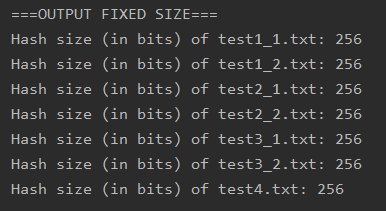
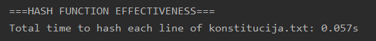

# Vladahashas
This is a university project with the goal of creating a hashing function that attempts to meet some of the standards of modern hashing functions.

## Hash function idea
 
Here you can see some pseudocode that demonstrates how the hashing function works. 

## Experimentational analysis
Analysis was done to test and confirm the following standards for the hashing function:
1. The input can be of any length
2. The output must be of fixed size (256 bits)
3. The function must be deterministic
4. The function should be fairly efficient (linear time)
5. Two hashes from relatively similar strings should be vastly different
6. Collisions should be unfeasible to find (finding a string that matches the hash of another string)

The following files were used for testing: 
test1_1.txt - contains the letter 'a' 
test1_2.txt - contains the letter 'b' 
test2_1.txt, test2_2, test3_1 - 1001 random characters 
test3_2.txt - same character as in test3_1, except a single character is changed 
test4.txt - empty file 
### Input of any length
 
Confirmed, input can be of any length.
### Output of fixed size
 
Confirmed, output is of fixed size (256 bits).
### Hashing function is deterministic
 
Confirmed, output stays the same for the same input.
### Hashing function is efficient
 
The algorithm has a complexity of O(n), therefore it is fairly efficient.
### Two hashes from similar strings should differ vastly
 
Confirmed, the outputs differ vastly even thought the input is similar.
### Collisions unfeasible to find
 
Out of 100,000 pairs 0 collisions have been found. Collisions are fairly unfeasible to find.

### Average difference between similar pairs
 

## Conclusions
The hashing algorithm meets all of the mentioned requirements. It is efficient, deterministic, collisions are also difficult to find.
